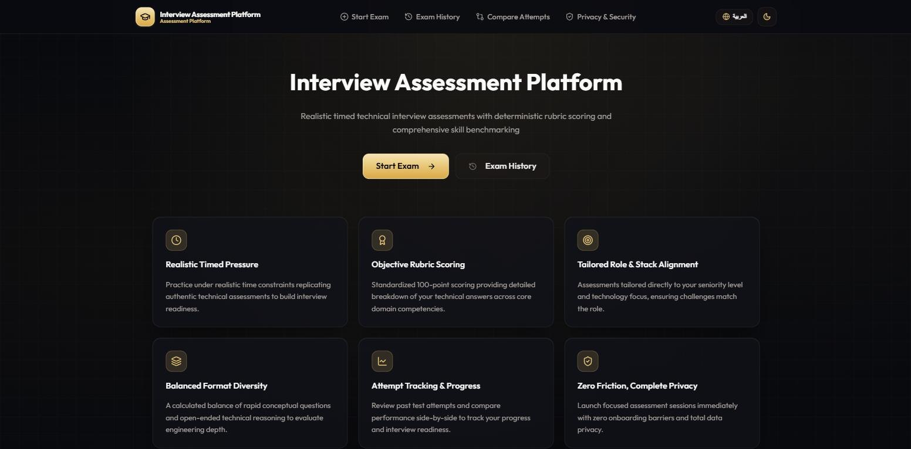

<div align="center">


### AI Interview Assessment Platform — English / العربية

Generate realistic, **timed technical interview exams** for any role and seniority, take them in a focused exam session, and get **objective 100-point scoring**, rubric-based feedback and a personalized study plan.

[](LICENSE)


**Engineered by Anas Aldahamsheh — تطوير: أنس الدحامشة**



</div>

---

## 📖 Overview

Exam Maker (Interview Assessment Platform) simulates real technical interview assessments:

1. **Configure** the session — target role, optional job description, experience level, question format, difficulty, number of questions, duration and exam language.
2. **Generate** a tailored exam with **Google Gemini** (or the built-in offline generator when no API key is set).
3. **Take the exam** under a real countdown timer with question navigation, mark-for-review and auto-submit when time runs out.
4. **Get graded** — multiple-choice answers are scored **deterministically**, written answers are evaluated against **structured rubrics**, and everything adds up to a **100-point score**.
5. **Improve** — review every question with explanations, practice missed questions or weak areas, and compare attempts over time.

Answer keys are **sealed on the server with AES-256-GCM**, so correct answers never reach the browser before submission.

---

## ✨ Features

### 🧩 Exam Setup & Generation
- Any job title, with an optional job description to tailor the questions
- Experience levels: **Junior / Mid-Level / Senior**
- Formats: **Multiple choice**, **written technical responses** or **mixed**
- Difficulty curve: Easy, Medium, Advanced or adaptive / mixed
- Custom question count, session duration and exam language (English / Arabic)

### ⏱️ Realistic Exam Session
- Timestamp-based countdown timer that **survives refreshes and background tabs**
- 5-minute and 1-minute warnings, then **automatic submission and lock** at 00:00
- Question navigator with answered / unanswered / marked-for-review states
- Submission confirmation that warns about unanswered or flagged questions

### 📊 Scoring & Feedback
- MCQ grading and final score calculation are **deterministic code**, never AI guesses
- Written answers evaluated with **structured AI rubric output** (validated with Zod)
- Question weights normalized to exactly **100 points**
- Results by **difficulty** and by **technical topic**
- AI evaluation: strengths, areas for growth, misconceptions, priority study topics, interview readiness and an actionable study plan
- Question-by-question **review** with answer keys, explanations and rubric details

### 📈 Progress Tracking
- **Exam history** stored locally in **IndexedDB** — no account required
- **Compare attempts** side by side to track improvement
- Retry an exam, **practice missed questions** or **practice weak areas**

### 🌍 Experience & Privacy
- Full **Arabic / English** interface with **RTL / LTR** layouts
- **Light / dark / system** theme
- Responsive and accessible UI
- No login, no server database — attempts stay in your browser

---

## 🧰 Tech Stack

| Layer | Technology |
|---|---|
| Framework | [Next.js 16](https://nextjs.org/) (App Router, Route Handlers) |
| UI | [React 19](https://react.dev/) + TypeScript |
| Styling | [Tailwind CSS 4](https://tailwindcss.com/) |
| AI | [Google Gemini](https://ai.google.dev/) via [`@google/genai`](https://www.npmjs.com/package/@google/genai) + offline fallback provider |
| Validation | [Zod](https://zod.dev/) |
| Persistence | IndexedDB via [`idb`](https://github.com/jakearchibald/idb) |
| Security | AES-256-GCM sealed answer keys (`node:crypto`) |
| Icons | [Lucide](https://lucide.dev/) |
| Testing | [Vitest](https://vitest.dev/) (unit + integration) |
| Package manager | [pnpm](https://pnpm.io/) |
| Deployment | [Netlify](https://www.netlify.com/) (`netlify.toml` included) |

---

## 🚀 Getting Started

### Prerequisites

- **Node.js 20.9+** (Node 22 LTS recommended — see [`.nvmrc`](.nvmrc))
- **pnpm** — install with `npm install -g pnpm` or enable it via `corepack enable`

### Installation

```bash
# 1. Clone the repository
git clone https://github.com/anas-aldahamsheh/Exam-Maker.git
cd Exam-Maker

# 2. Install dependencies
pnpm install

# 3. Create your environment file
cp .env.example .env.local      # on Windows (PowerShell): copy .env.example .env.local

# 4. Start the development server
pnpm dev
```

Open **[http://localhost:3000](http://localhost:3000)** — you will be redirected to `/en` (use `/ar` for Arabic).

### Environment Variables

All variables are documented in [`.env.example`](.env.example).

| Variable | Required | Default | Description |
|---|---|---|---|
| `GEMINI_API_KEY` | No | — | Google Gemini API key — get one at [Google AI Studio](https://aistudio.google.com/apikey). Leave empty to use the offline generator |
| `GEMINI_MODEL` | No | `gemini-2.5-flash` | Gemini model used for generation and grading |
| `EXAM_SEAL_SECRET` | **Yes in production** | development fallback | Secret (min. 16 chars) used to seal answer keys — use a long random value |

> ⚠️ Never commit your real `.env.local` file. It is already excluded by `.gitignore`.

---

## 📜 Available Scripts

| Command | Description |
|---|---|
| `pnpm dev` | Start the development server |
| `pnpm build` | Create a production build |
| `pnpm start` | Run the production build |
| `pnpm test` | Run tests in watch mode (Vitest) |
| `pnpm test:run` | Run the test suite once |
| `pnpm typecheck` | Type-check with TypeScript |
| `pnpm lint` | Lint with ESLint |

---

## 🔌 API

| Endpoint | Method | Description |
|---|---|---|
| `/api/exam/generate` | `POST` | Validates the exam setup and generates a new exam with sealed answer keys |
| `/api/exam/generate-practice` | `POST` | Generates a practice exam from missed questions or weak topics |
| `/api/exam/grade-written` | `POST` | Grades the attempt: deterministic MCQ scoring + rubric evaluation of written answers + final feedback |
| `/api/health` | `GET` | Health check |

---

## 🏗️ Project Structure

```txt
src/
├── app/
│   ├── [locale]/            # Localized pages (en / ar)
│   │   ├── setup/           #   Exam configuration
│   │   ├── exam/[attemptId] #   Timed exam session
│   │   ├── grading/         #   Grading progress
│   │   ├── results/         #   Score & AI feedback
│   │   ├── review/          #   Question-by-question review
│   │   ├── history/         #   Past attempts
│   │   ├── compare/         #   Compare attempts
│   │   └── privacy/
│   └── api/                 # Route handlers (generate, practice, grading, health)
├── ai/                      # Gemini & offline providers, prompt templates, Zod schemas
├── exam/                    # Core logic: generation, randomization, scoring, weights, state machine
├── features/                # UI features: setup, session, navigator, timer, results, review, history, comparison
├── persistence/             # IndexedDB database & repositories
├── lib/                     # Env config, i18n dictionaries (en / ar), crypto (answer-key sealing)
├── ui/                      # Navbar, footer, UI primitives, theme & i18n providers
└── types/                   # Shared TypeScript types
tests/
├── unit/                    # Scoring, weights, timer, state machine, crypto, i18n, env, randomization
└── integration/             # Full exam flow
```

---

## 🧪 Testing

```bash
pnpm test:run     # unit + integration tests
pnpm typecheck    # type safety
```

---

## ☁️ Deployment (Netlify)

1. Connect the repository in Netlify — `netlify.toml` runs `pnpm build` on Node 22 with the Next.js plugin.
2. Set `GEMINI_API_KEY`, `GEMINI_MODEL` and a strong `EXAM_SEAL_SECRET` in the Netlify environment variables.
3. Deploy and smoke-test both `/en` and `/ar`.

---

## 📄 License

This project is licensed under the [MIT License](LICENSE).

---

## 👨‍💻 Author

**Anas Aldahamsheh — أنس الدحامشة**

- 📞 Phone: `+962 789 495 167`
- 💼 LinkedIn: [linkedin.com/in/anas-aldahamsheh](https://www.linkedin.com/in/anas-aldahamsheh)
- 🐙 GitHub: [github.com/anas-aldahamsheh](https://github.com/anas-aldahamsheh)

---

<div align="center">

⭐ If you find this project useful, consider giving it a star!

</div>
